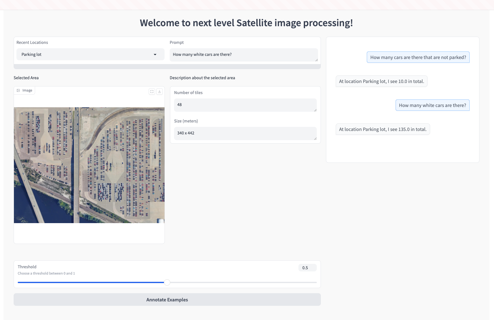
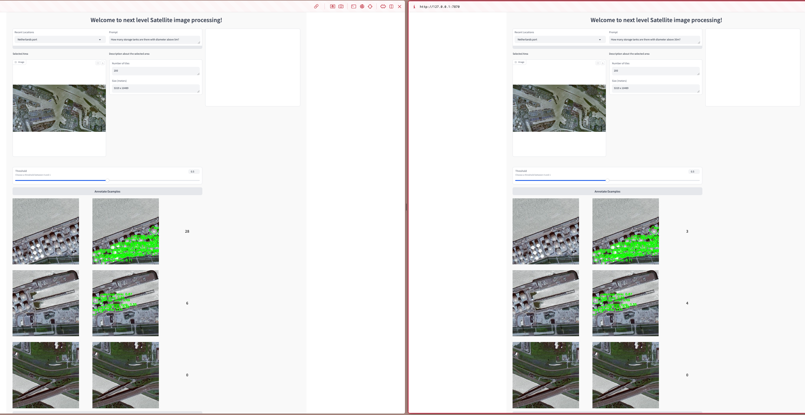
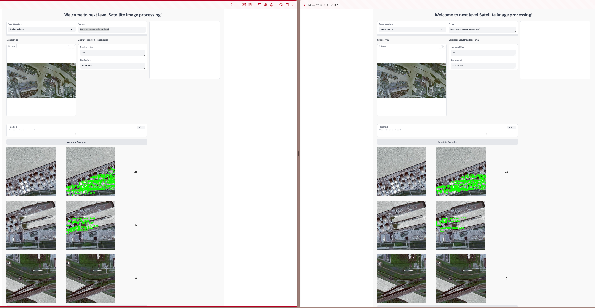

<nobr><sup><sup>© 2024 OpenAI</sup></sup></nobr>

# Description
**Any Question Any Place** is an AI-powered platform that combines Large Language Models (LLM) and Computer Vision (CV) to analyze satellite imagery interactively. 

### How it works:
1. **Input**: 
   - A satellite image (e.g., of storage tanks)
   - A natural language question about the image (e.g., "How many storage tanks have a diameter greater than 5m?")

2. **Processing**:
   - The LLM acts as an expert interpreter
   - It analyzes the user's question
   - It selects and calls appropriate computer vision tools 
   - It post-processes the output before generating a human-friendly responses

3. **Features**:
   - Supports various interpretation tasks using specialized remote sensing datasets
   - Uses image captioning to help the LLM better understand satellite imagery context
   - Provides natural language responses to complex visual queries

This platform bridges the gap between technical satellite image analysis and user-friendly interaction, allowing anyone to extract insights from satellite imagery through simple questions.

# Use cases
### Objects
**Supported classes:**

plane, ship, storage tank, ground track field, large vehicle, small vehicle, helicopter

**Question Examples:**

- How many ships are there in the image? *(count)*
- How many storage tanks are there with diameter above 5m? *(count with constrating on size)*
- How many planes are in the image? *(if non-existing object, is not counted)*
- How many cars are there in the image? *(non-supported classes are responded by GPT-4o mini)*
- How many cars are there that are not parked?

### Fields
**Supported classes:**

urban land, agriculture, rangeland, forest land, water, barren land

**Question: Examples**

- What is the area of agriculture land / forest? *(deforestation analysis)*
- What is the ratio of water in the image?
- What is occupies the largest area in the image?

### Solar

**Question Example:**

- What is the coverage of the solar panels in the image?

**Any type of questions not mentioned above will be answered by GPT-4o mini**

# Demonstration

<nobr><sup><sup>Counting with specifications</sup></nobr>


<nobr><sup>Counting with constrating on diameter</sup></nobr>


<nobr><sup>Thesholding on uncertainty</sup></nobr>

# Usage
### Install dependencies
```
conda env create -f environment.yml
```

### Structure
```
vitol/
├── app.ipynb
├── backend                 # CV models
├── bot                     # LLM around CV models
├── sattelite_downloader    # Sattelite image downloader
├── app.ipynb               # Demo on Gradio
```